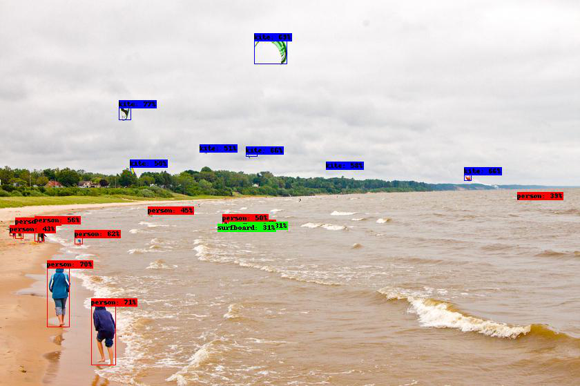
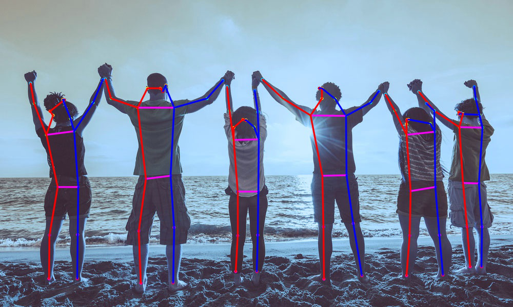
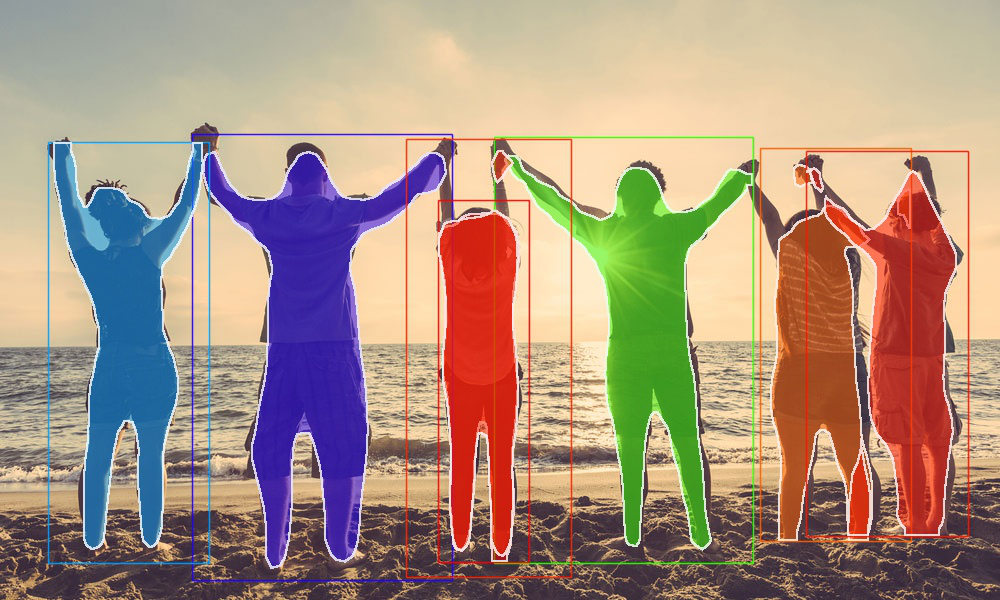
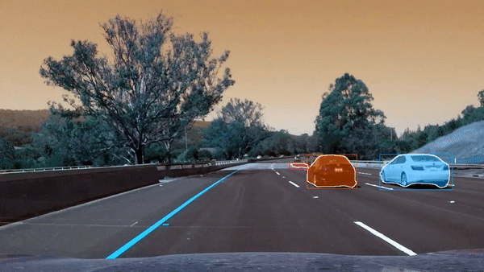

# Xtreme-Vision

[](https://patreon.com/adeelintizar) [](LICENSE.txt)





`Go to PyPI page`> [Here](https://pypi.org/project/xtreme-vision/)
This is the Official Repository of Xtreme-Vision. Xtreme-Vision is a Python Library which is built with simplicity in mind for Computer Vision Tasks, such as Object-Detection, Human-Pose-Estimation, Image-Segmentation Tasks, it provides the support of a list of state-of-the-art algorithms, You can Start Detecting with Pretrained Weights as well as You can train the Models On Custom Dataset.

Currently, It Provides the Solution for the following Tasks:
   - Object-Detection
   - Pose-Estimation
   - Image-Segmentation


For Detection with pre-trained models it provides:
  - RetinaNet
  - CenterNet
  - YOLOv4
  - TinyYOLOv4
  - Mask-RCNN

For Custom Training It Provides:
  - YOLOv4
  - TinyYOLOv4





>In Future it will provide solution for a wide variety of Computer-Vision Tasks such as Object-Detection, Pose-Estimation, Image-Segmentation, Image-Prediction, Auto-Encoders and GANs.

>If You Like this Project Please do support it by donating here [](https://patreon.com/adeelintizar)


### Dependencies:
  - Tensorflow >= 2.3.0
  - Keras
  - Opencv-python
  - Numpy
  - Pillow
  - Matplotlib
  - Pandas
  - Scikit-learn
  - Progressbar2
  - Scipy
  - H5Py


## **`Get Started:`**
```python
!pip install xtreme-vision
```
 >### `For More Tutorials of Xtreme-Vision, Click` [Here](https://github.com/Adeel-Intizar/Xtreme-Vision/tree/master/Tutorials)
# **`RetinaNet` Example** 

### **`Image Object_Detection` Using `RetinaNet`** 


```python
from xtreme_vision.Detection import Object_Detection

model = Object_Detection()
model.Use_RetinaNet()
model.Detect_From_Image(input_path='kite.jpg',
                        output_path='./retinanet.jpg', 
                        extract_objects=True)

from PIL import Image
Image.open('retinanet.jpg')
```
