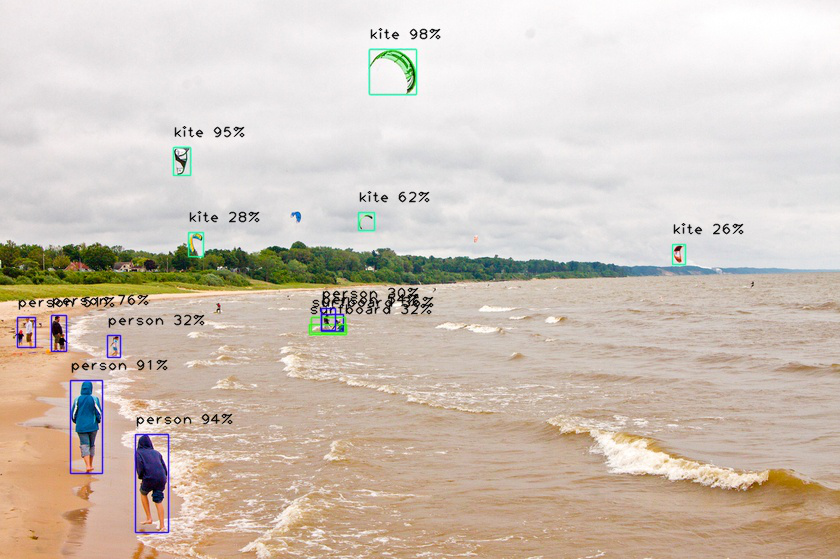
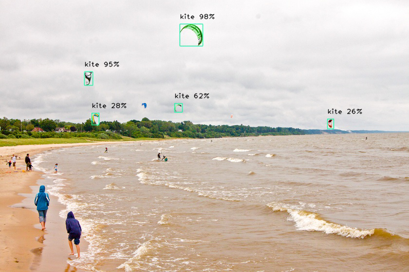
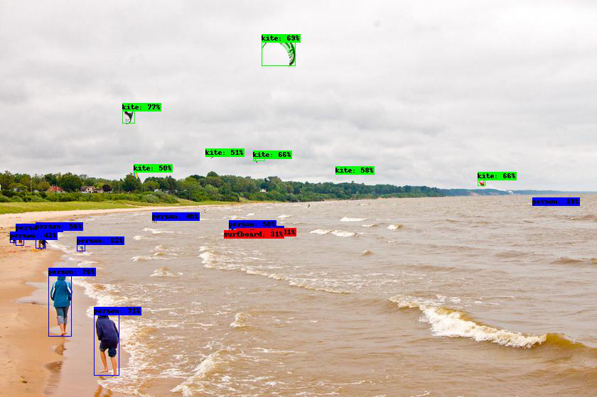
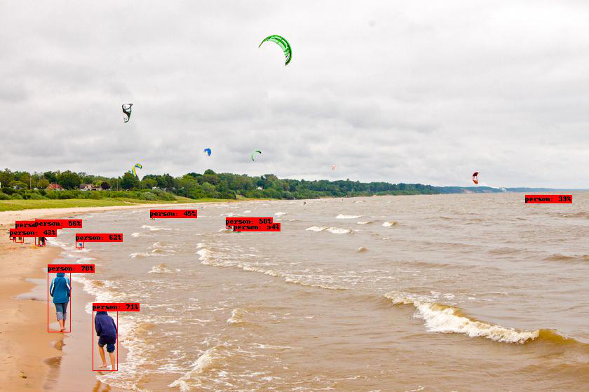
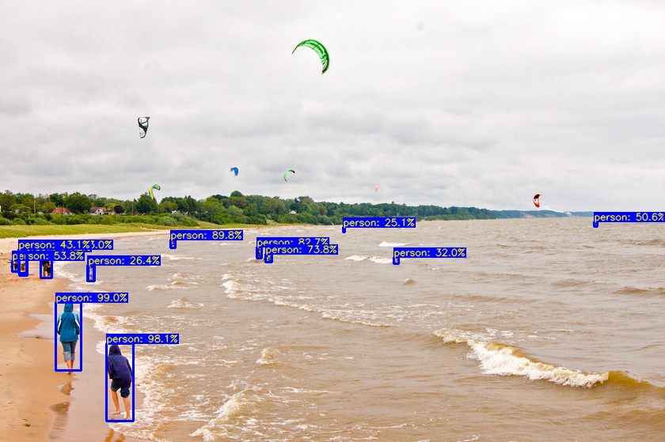
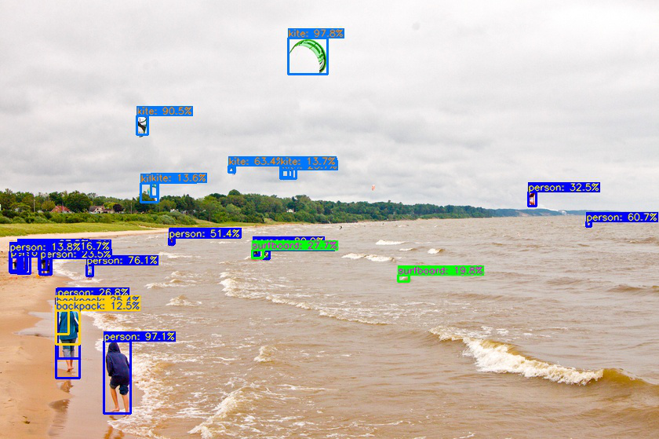
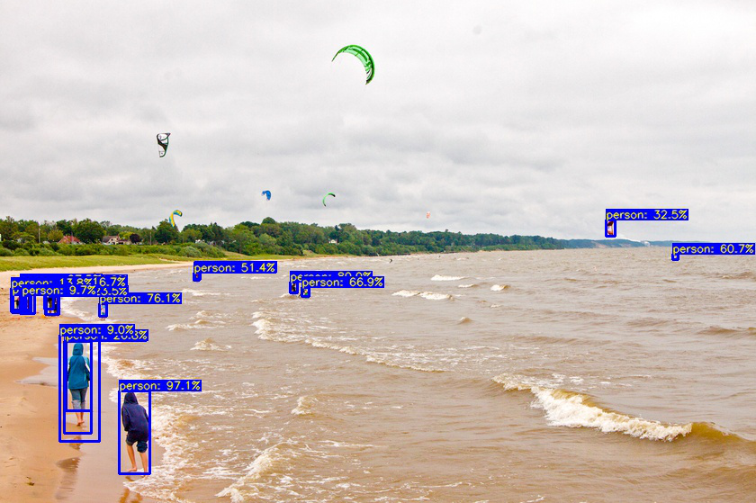

# Xtreme-Vision

[](https://patreon.com/adeelintizar) [](LICENSE.txt)


Xtreme-Vision is a Python Library which is built with simplicity in mind for Computer Vision Tasks, Currently it provides the solution for only Object-Detection Tasks, it provides the support of a list of state-of-the-art algorithms for Object Detection, Video Object Detection and Training on Custom Datasets. Currently it supports 4 different algorithms. For Detection with pre-trained models it provides:

  - RetinaNet
  - CenterNet
  - YOLOv4
  - TinyYOLOv4

For Custom Training It Provides:
  - YOLOv4
  - TinyYOLOv4

>In Future it will not be limited to just Object-Detection, it will provide solution for a wide variety of Computer-Vision Tasks such as Image-Segmentation, Image-Prediction, Auto-Encoders and GANs.

>If You Like this Project Please do support it by donating [here](https://patreon.com/adeelintizar)


### Dependencies:
  - Tensorflow >= 2.3.0
  - Keras
  - Opencv-python
  - Numpy
  - Pillow
  - Matplotlib
  - Pandas
  - Scikit-learn
  - Progressbar2
  - Scipy
  - H5Py


## **`Get Started:`**
```python
!pip install xtreme-vision
```

# **`RetinaNet` Examples** 

### **`Image Object_Detection` Using `RetinaNet`** 


```python
from xtreme_vision.Detection import Object_Detection

model = Object_Detection()
model.Use_RetinaNet()
model.Detect_From_Image(input_path='kite.jpg',
                        output_path='./retinanet.jpg', 
                        extract_objects=True)

from PIL import Image
Image.open('retinanet.jpg')
```

    Found Existing Weights File...
    Loading Existing File...
    WARNING:tensorflow:No training configuration found in the save file, so the model was *not* compiled. Compile it manually.
    


    

    


## **`Video Object_Detection` Using `RetinaNet`** 


```python
model.Use_RetinaNet()
model.Detect_From_Video(input_path = 'road.mp4', 
                        output_path='./retinanet.mp4', 
                        extract_objects=False)
```

    Found Existing Weights File...
    Loading Existing File...
    WARNING:tensorflow:No training configuration found in the save file, so the model was *not* compiled. Compile it manually.
    
    There are 38 Frames in this video
    --------------------
    Detecting Objects in the Video... Please Wait...
    --------------------
    Done. Processing has been Finished... Please Check Output Video.
    

## **`Custom_Image_Object_Detection` Using `RetinaNet`** 


```python
custom_objects = model.Custom_Objects(kite=True, person=False)

model.Detect_Custom_Objects_From_Image(custom_objects, 
                                       input_path = 'kite.jpg',
                                       output_path = './custom_detection.jpg', 
                                       minimum_percentage_probability = 0.2,
                                       extract_objects=False)

Image.open('custom_detection.jpg')
```


    

    


## **`Custom_Video_Object_Detection` Using `RetinaNet`** 


```python
custom_obj = model.Custom_Objects(car=True)
model.Detect_Custom_Objects_From_Video(custom_obj, 
                                       input_path = 'road.mp4',
                                       output_path = './custom_video.mp4',
                                       minimum_percentage_probability = 0.2, 
                                       extract_objects=False)
```

    Found Existing Weights File...
    Loading Existing File...
    WARNING:tensorflow:No training configuration found in the save file, so the model was *not* compiled. Compile it manually.
    
    There are 38 Frames in this video
    --------------------
    Detecting Objects in the Video... Please Wait...
    --------------------
    Done. Processing has been Finished... Please Check Output Video.
    

# **`CenterNet`** 


## **`Image Object_Detection` Using `CenterNet`** 


```python
model.Use_CenterNet()
model.Detect_From_Image(input_path= 'kite.jpg', 
                        output_path='./centernet.jpg')

Image.open('centernet.jpg')
```

    Downloading Weights File...
    Please Wait...
    Downloading data from https://github.com/Licht-T/tf-centernet/releases/download/v1.0.6/centernet_pretrained_coco.h5
    766869504/766861424 [==============================] - 12s 0us/step
    


    

    


## **`Video Object_Detection` Using `CenterNet`** 


```python
model.Use_CenterNet()
model.Detect_From_Video(input_path= 'road.mp4', 
                        output_path='./centernet.mp4')
```

    Found Existing Weights File...
    Loading Existing File...
    
    There are 38 Frames in this video
    --------------------
    Detecting Objects in the Video... Please Wait...
    --------------------
    Done. Processing has been Finished... Please Check Output Video.
    

## **`Cutom_Image_Object_Detection` Using `CenterNet`** 


```python
custom_objects = model.Custom_Objects(kite=False, person=True)
model.Use_CenterNet()
model.Detect_Custom_Objects_From_Image(custom_objects, 
                                       input_path = 'kite.jpg',
                                       output_path = './custom_detection.jpg')

Image.open('custom_detection.jpg')
```

    Found Existing Weights File...
    Loading Existing File...
    


    

    


## **`Cutom_Video_Object_Detection` Using `CenterNet`** 


```python
custom_obj = model.Custom_Objects(car=False, person=True)

model.Detect_Custom_Objects_From_Video(custom_obj, 
                                       input_path = 'road.mp4',
                                       output_path = './custom_video.mp4')
```

    
    There are 38 Frames in this video
    --------------------
    Detecting Objects in the Video... Please Wait...
    --------------------
    Done. Processing has been Finished... Please Check Output Video.
    

# **`YOLOv4` Examples** 

## **`Image Object_Detection` Using `YOLOv4`** 


```python
model.Use_YOLOv4(iou = 0.45, score = 0.25)
model.Detect_From_Image(input_path= 'kite.jpg', 
                        output_path= './yolov4.jpg')
Image.open('yolov4.jpg')
```

    Downloading weights file...
    Please wait...
    Downloading data from https://github.com/Adeel-Intizar/Xtreme-Vision/releases/download/1.0/yolov4.weights
    257720320/257717640 [==============================] - 8s 0us/step
    Downloading Classes File...
    Please wait...
    Downloading data from https://raw.githubusercontent.com/pjreddie/darknet/master/data/coco.names
    8192/625 [=========================================================================================================================================================================================================================================================================================================================================================================================================] - 0s 0us/step
    


    

    


## **`Video Object_Detection` Using `YOLOv4`** 


```python
model.Use_YOLOv4()
model.Detect_From_Video(input_path= 'road.mp4', 
                        output_path= './yolo.mp4')
```

    Found Existing weights file...
    Loading existing file...
    Found Existing Classes File...
    Loading Existing File...
    
    There are 38 Frames in this video
    --------------------
    Detecting Objects in the Video... Please Wait...
    --------------------
    Done. Processing has been Finished... Please Check Output Video.
    

## **`Cutom_Image_Object_Detection` Using `YOLOv4`** 


```python
custom_objects = model.Custom_Objects(kite=False, person=True)
model.Use_YOLOv4()
model.Detect_Custom_Objects_From_Image(custom_objects, 
                                       input_path = 'kite.jpg',
                                       output_path = './custom_detection.jpg')

Image.open('custom_detection.jpg')
```

    Found Existing weights file...
    Loading existing file...
    Found Existing Classes File...
    Loading Existing File...
    


    

    


## **`Cutom_Video_Object_Detection` Using `YOLOv4`** 


```python
custom_obj = model.Custom_Objects(car=True, person=False)
model.Use_YOLOv4()
model.Detect_Custom_Objects_From_Video(custom_obj, 
                                       input_path = 'road.mp4',
                                       output_path = './custom_video.mp4')
```

    Found Existing weights file...
    Loading existing file...
    Found Existing Classes File...
    Loading Existing File...
    
    There are 38 Frames in this video
    --------------------
    Detecting Objects in the Video... Please Wait...
    --------------------
    Done. Processing has been Finished... Please Check Output Video.
    

# **`TinyYOLOv4`**

## **`Image Object_Detection` Using `TinyYOLOv4`** 


```python
model.Use_TinyYOLOv4()
model.Detect_From_Image(input_path= 'kite.jpg', 
                        output_path= './tinyyolov4.jpg')
Image.open('tinyyolov4.jpg')
```

    Downloading weights file...
    Please wait...
    Downloading data from https://github.com/Adeel-Intizar/Xtreme-Vision/releases/download/1.0/yolov4-tiny.weights
    24256512/24251276 [==============================] - 0s 0us/step
    Found Existing Classes File...
    Loading Existing File...
    


    

    


## **`Video Object_Detection` Using `TinyYOLOv4`** 


```python
model.Use_TinyYOLOv4()
model.Detect_From_Video(input_path= 'road.mp4', 
                        output_path= './tinyyolo.mp4')
```

    Found Existing weights file...
    Loading existing file...
    Found Existing Classes File...
    Loading Existing File...
    
    There are 38 Frames in this video
    --------------------
    Detecting Objects in the Video... Please Wait...
    --------------------
    Done. Processing has been Finished... Please Check Output Video.
    

## **`Cutom_Image_Object_Detection` Using `TinyYOLOv4`** 


```python
custom_objects = model.Custom_Objects(kite=False, person=True)
model.Use_TinyYOLOv4()
model.Detect_Custom_Objects_From_Image(custom_objects, 
                                       input_path = 'kite.jpg',
                                       output_path = './custom_detection.jpg')

Image.open('custom_detection.jpg')
```

    Found Existing weights file...
    Loading existing file...
    Found Existing Classes File...
    Loading Existing File...
    


    

    


## **`Cutom_Video_Object_Detection` Using `TinyYOLOv4`** 


```python
custom_obj = model.Custom_Objects(car=True, person=False)
model.Use_TinyYOLOv4()
model.Detect_Custom_Objects_From_Video(custom_obj, 
                                       input_path = 'road.mp4',
                                       output_path = './custom_video.mp4')
```

    Found Existing weights file...
    Loading existing file...
    Found Existing Classes File...
    Loading Existing File...
    
    There are 38 Frames in this video
    --------------------
    Detecting Objects in the Video... Please Wait...
    --------------------
    Done. Processing has been Finished... Please Check Output Video.
    
## **`Training YOLOv4`**


```python
from xtreme_vision.Detection.Custom import Train_Custom_Detector

model = Train_Custom_Detector()

model.Use_YOLOv4(classes_path = 'classes.names',
                 input_size = 608,
                 batch_size = 4)

model.load_data(train_annot_path = 'training.txt',
                train_img_dir = './',
                val_annot_path = 'validation.txt',
                val_img_dir = './',
                weights_path = None)

model.train(epochs=1,
            lr = 0.001)
```

    Downloading weights file...
    Please wait...
    Downloading data from https://github.com/Adeel-Intizar/Xtreme-Vision/releases/download/1.0/yolov4.conv.137
    170041344/170038676 [==============================] - 6s 0us/step
    grid: 76 iou_loss: 0 conf_loss: 11595.1035 prob_loss: 0 total_loss 11595.1035
    grid: 38 iou_loss: 0 conf_loss: 3064.89893 prob_loss: 0 total_loss 3064.89893
    grid: 19 iou_loss: 5.32760048 conf_loss: 754.432129 prob_loss: 12.6405106 total_loss 772.400208
    grid: 76 iou_loss: 0 conf_loss: 11580.3936 prob_loss: 0 total_loss 11580.3936
    grid: 38 iou_loss: 0 conf_loss: 3053.11182 prob_loss: 0 total_loss 3053.11182
    grid: 19 iou_loss: 2.52579117 conf_loss: 738.940308 prob_loss: 7.94215679 total_loss 749.408264
    WARNING:tensorflow:From /usr/local/lib/python3.6/dist-packages/tensorflow/python/ops/summary_ops_v2.py:1277: stop (from tensorflow.python.eager.profiler) is deprecated and will be removed after 2020-07-01.
    Instructions for updating:
    use `tf.profiler.experimental.stop` instead.
    WARNING:tensorflow:Callbacks method `on_train_batch_end` is slow compared to the batch time (batch time: 0.4511s vs `on_train_batch_end` time: 0.9003s). Check your callbacks.
    grid: 76 iou_loss: 0 conf_loss: 11562.1973 prob_loss: 0 total_loss 11562.1973
    grid: 38 iou_loss: 0 conf_loss: 3040.45654 prob_loss: 0 total_loss 3040.45654
    grid: 19 iou_loss: 3.14010191 conf_loss: 746.206482 prob_loss: 9.11074448 total_loss 758.457275
    100/100 - 101s - loss: 13846.6777 - output_1_loss: 10834.2402 - output_2_loss: 2450.5334 - output_3_loss: 510.8344 - val_loss: 14023.4814 - val_output_1_loss: 10223.1758 - val_output_2_loss: 3002.9417 - val_output_3_loss: 746.2946
    

## **`Training TinyYOLOv4`**


```python
from xtreme_vision.Detection.Custom import Train_Custom_Detector

model = Train_Custom_Detector()

model.Use_TinyYOLOv4(classes_path = 'classes.names',
                 input_size = 608,
                 batch_size = 4)

model.load_data(train_annot_path = 'training.txt',
                train_img_dir = './',
                val_annot_path = 'validation.txt',
                val_img_dir = './',
                weights_path = None)

model.train(epochs=1,
            lr = 0.001)
```

    Downloading weights file...
    Please wait...
    Downloading data from https://github.com/Adeel-Intizar/Xtreme-Vision/releases/download/1.0/yolov4-tiny.conv.29
    19791872/19789716 [==============================] - 0s 0us/step
    grid: 38 iou_loss: 0 conf_loss: 3029.71387 prob_loss: 0 total_loss 3029.71387
    grid: 19 iou_loss: 5.33834457 conf_loss: 748.023438 prob_loss: 13.9181871 total_loss 767.279968
    grid: 38 iou_loss: 0 conf_loss: 3026.50098 prob_loss: 0 total_loss 3026.50098
    grid: 19 iou_loss: 1.93527794 conf_loss: 744.744629 prob_loss: 6.48417282 total_loss 753.164124
    WARNING:tensorflow:Callbacks method `on_train_batch_end` is slow compared to the batch time (batch time: 0.0785s vs `on_train_batch_end` time: 0.9440s). Check your callbacks.
    grid: 38 iou_loss: 0 conf_loss: 3022.73486 prob_loss: 0 total_loss 3022.73486
    grid: 19 iou_loss: 2.52412939 conf_loss: 745.861145 prob_loss: 6.20057869 total_loss 754.585815
    100/100 - 22s - loss: 3590.1985 - output_1_loss: 2886.6526 - output_2_loss: 698.5931 - val_loss: 3517.7322 - val_output_1_loss: 2858.8828 - val_output_2_loss: 653.8980
    
